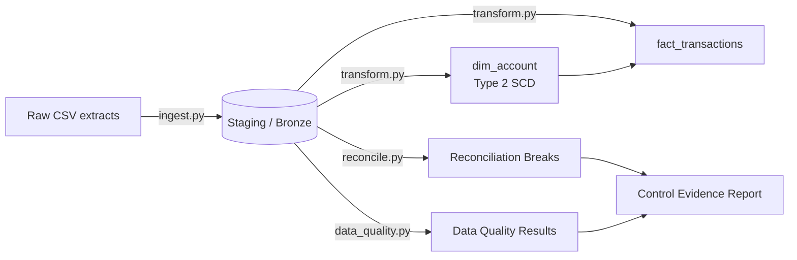

# Finance Reconciliation Pipeline


**[← Back to live portfolio](https://andiswamatai.github.io)**

A source → sub-ledger → GL reconciliation pipeline for financial transactions, built the way it would run in a bank's finance data mesh: idempotent ingestion, a conformed Type 2 SCD dimension, embedded data quality controls, and an automated reconciliation engine that produces audit-ready exception reports.

This mirrors the kind of finance data product I build day to day as a Senior Data Engineer in Global Markets — see my CV/LinkedIn for the production context this is modelled on.

## Why this exists

Finance and risk teams need to trust that a number on a report actually traces back to a real transaction. That means every transaction has to survive three checks before it's trusted: did it post to the sub-ledger, does the posted amount match, and does the sub-ledger net agree with the general ledger balance. This project implements exactly that chain, end to end, on synthetic data with deliberately injected breaks so the engine has something real to catch.

## Architecture



**Pipeline stages**

| Stage | Module | What it does |
|---|---|---|
| Ingest | `src/ingest.py` | Idempotent load of raw extracts into staging (`INSERT OR REPLACE` keyed on natural key) |
| Transform | `src/transform.py` | Bronze → Silver/Gold: Type 2 SCD `dim_account`, conformed `fact_transactions` |
| Data Quality | `src/data_quality.py` | Completeness, postings coverage, and amount accuracy checks against thresholds |
| Reconcile | `src/reconcile.py` | Source → sub-ledger → GL reconciliation, flags `MISSING_POSTING`, `AMOUNT_BREAK`, `TIMING_BREAK`, `GL_VARIANCE` |
| Orchestrate | `src/run_pipeline.py` | Runs all of the above and prints a control evidence summary |

## Tech stack

Python, SQLite (chosen so the project runs anywhere with zero setup — `sql/scd2_dim_account.sql` documents the same logic in Synapse/SQL Server `MERGE` syntax, which is how it's implemented in production), pandas, unittest.

## Running it

```bash
pip install -r requirements.txt
python src/generate_sample_data.py   # creates synthetic data in data/raw/
python src/run_pipeline.py
```

Sample output:

```
[3/4] Running data quality checks...
   [PASS] transactions_completeness: 100.00%
   [PASS] postings_coverage: 97.44%
   [PASS] amount_accuracy: 96.49%

[4/4] Reconciling source -> sub-ledger -> GL...
   source-to-subledger breaks: 21
   subledger-to-GL variances:  0

CONTROL EVIDENCE SUMMARY
   AMOUNT_BREAK: 8
   MISSING_POSTING: 6
   TIMING_BREAK: 7
   data quality checks failed: 0
```

Run the tests:

```bash
python -m unittest discover -s tests -v
```

## What I'd add for production

- Swap SQLite for Azure Synapse / SQL Server and use the `MERGE`-based SCD2 logic in `sql/scd2_dim_account.sql` directly.
- Replace the orchestrator with Azure Data Factory pipelines or Airflow DAGs, with retries and alerting on data quality failures.
- Push `reconciliation_breaks` to a Power BI exception-reporting dashboard for daily review by Finance.

## License

MIT — feel free to reuse for your own learning.

